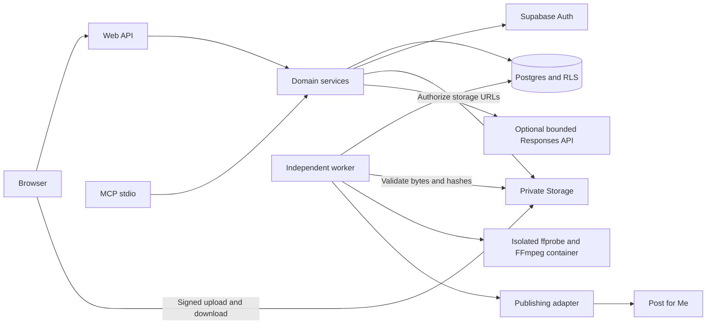

# Architecture

MediaFlock uses Next.js, React, and TypeScript. The web app and versioned API share domain services with a stdio MCP server. A separate Node worker processes the Postgres queue, validates media, creates derivatives, and collects analytics. The queue needs no Redis or cloud scheduler.

The public page is `/`. Account pages include `/signin`, `/signup`, `/forgot-password`, and `/reset-password`. The workspace is `/app`. A `screen` query on `/` redirects to `/app` for existing links.

The web app can run privately on the Mac or publicly on Vercel. Both use the same Supabase database, Auth, and private Storage. The Mac worker remains independent. This architecture description does not claim that a public deployment has passed production checks.

`packages/domain` owns source packages, revisions, registration, authorization, approvals, account rules, connections, and credentials. `packages/publishing` maps approved content to provider requests. `packages/analytics` stores provider responses and normalized metrics. `packages/experiments` compares compatible samples and retains their evidence. `packages/media` validates originals, authorizes media transport, and creates derivatives.

Registration starts closed. After admission, a verified Auth identity receives one private workspace and an owner membership. User-supplied metadata cannot choose a workspace or grant another role. Transaction locks prevent duplicate allocations and concurrent quota bypass. Account endpoints enforce request bounds, password rules, and request limits. Email delivery readiness uses a separate flag. An optional one-use recovery-code flow has its own disabled-by-default flag. It stores a peppered hash, requires the current password for rotation, and invalidates application sessions during recovery. It does not establish email ownership or change Supabase confirmation policy. Public admission and recovery selection remain pending.

Each request checks current membership and environment mode. Scoped transactions use a non-bypass database role with an explicit workspace and authenticated user. Foreign keys and RLS enforce workspace ownership independently of UI filters. Workers use explicit workspace contexts after an atomic job claim.

The Vercel web app uses Supabase transaction pooling and `DB_POOL_MAX=1`. The Mac worker can use session pooling with the default pool size of 12. Database TLS verifies the server certificate and hostname. `DATABASE_SSL_CA` supplies inline PEM on Vercel. `DATABASE_SSL_CA_FILE` supports a certificate file on the Mac.

Integration credentials use authenticated encryption tied to the workspace and service. Every web and worker runtime must use the same `CREDENTIAL_ENCRYPTION_KEY`. Public workspaces supply their own keys through Connections. Server-wide provider credentials must stay empty when they must not serve as a fallback for other workspaces.

Approvals and deliveries are separate. Approval binds the revision, ordered media hashes and dimensions, destination account, connection version, provider settings, privacy, and schedule. Database triggers protect revisions, approval records, assets, and audit events. The worker verifies media hashes before it forwards bytes to a provider.

The queue has one active delivery per variant and one target per approval. Claims use account locks, durable leases, and fencing tokens. The worker records attempts before external calls. It retains late responses without overwriting a newer lease. A late provider ID can support an authenticated status check. The worker checks unknown write results without another submission.

After acceptance, Post for Me owns scheduling. MediaFlock requires a native result for each account before it confirms publication. Cancellation stays pending until the provider confirms its final state.

Browsers request an upload reservation before they send media. The API creates a signed URL for a server-generated private Storage path. The URL does not allow overwrite. The browser sends bytes directly to Storage, then requests validation. The worker checks size, SHA-256 hash, actual file type, dimensions, and duration. The signed upload path is staging. After validation, the worker records verified metadata and copies the bytes to a separate immutable path with no overwrite. It verifies that final copy before exposing the asset. Retries recover an identical existing final copy; a different existing copy fails validation. Only validated immutable originals become usable assets.

Originals and derivatives share a 1 GiB workspace allowance. They also share a 20-request limit over 24 hours and three pending jobs. Full-size reservations cover both staging and a separate original when a client understates file size. Staged and quarantined bytes count against the allowance. Expired and failed uploads preserve any original bytes and retain capacity for stored objects. A server-only aggregate and global transaction lock also enforce `MEDIAFLOCK_STORAGE_TOTAL_BYTES` across workspaces; its live default is 1 GiB. Workspace limits do not increase the hosting project’s quota.

The asset API verifies workspace access before returning a 307 redirect to a signed Storage URL. Download URLs last 60 seconds. Supabase serves the body and byte ranges. This avoids Vercel's Function request and response body limit without making the bucket public.

Media jobs use separate durable leases and immutable output paths. All live probes and FFmpeg operations run through a dedicated Docker context. The image uses a pinned official Debian digest and Debian FFmpeg, libass, and DejaVu fonts; the installed image ID is recorded at startup. Runtime never pulls an image and never falls back to host parsing. Arguments remain arrays, with bounded output, runtime, and restricted file protocols.

Each job runs as UID 65532 without network access, Linux capabilities, or privilege escalation. The root filesystem is read-only. Only copied job inputs are mounted, read-only; application credentials and the host home directory are excluded. Memory and swap total 512 MiB, CPU is limited to two cores, and the process limit is 64. Writable scratch space uses a 128 MiB work tmpfs and a separate 16 MiB temporary tmpfs. A trusted helper stops decoder descendants and streams one regular output of at most 50 MiB. It rejects symlinks.

Container cleanup runs after success, failure, and timeout. Startup and periodic worker cleanup remove only matching app containers and private staging leftovers older than five minutes. Worker heartbeat updates independently of lengthy parsing. Originals remain unchanged. Approval captures the thumbnail file type and derivative dimensions.

The web app does not run a persistent worker or FFmpeg during a request. A daily Vercel cron cannot replace this queue worker. Uploads, derivatives, publication, and analytics wait when the Mac is asleep or offline.

The storage and publishing interfaces can support another backend or provider later. V1 uses private Supabase Storage and Post for Me uploads. It needs no public tunnel or long-lived source-media URL.
