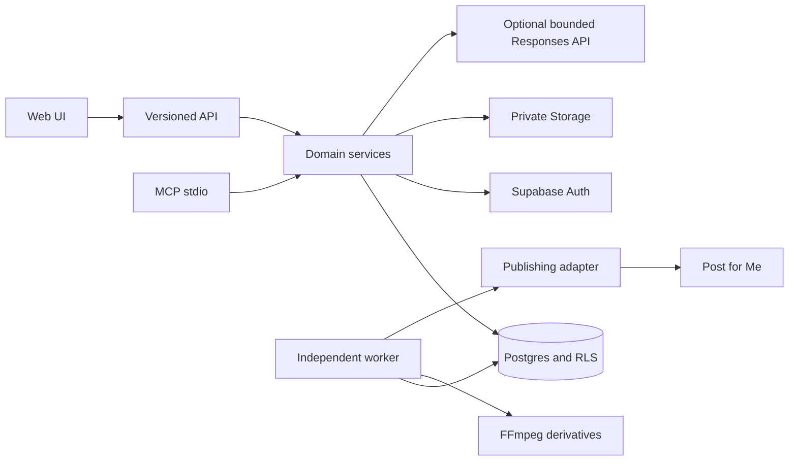

# Architecture

MediaFlock is a modular Next.js/React/TypeScript application. Web UI and versioned API share domain services with a stdio MCP server. A separate Node worker drains the Postgres queue, processes media, and collects permitted analytics. No Redis or additional cloud scheduler is required.

`packages/domain` owns source packages, immutable revisions, authorization, approvals, account rules, connection binding and credentials. `packages/publishing` owns provider contracts and semantic serialization. `packages/analytics` stores raw permitted responses and normalized observations. `packages/experiments` compares matched account/format/horizon/definition samples and stores inspectable evidence. `packages/media` validates originals and processes bounded derivatives.

Each request obtains a fresh membership and mode check. Scoped transactions use a non-bypass database role with an explicit workspace and authenticated user. Cross-workspace foreign keys and RLS enforce ownership independently of UI filtering. Workers use explicit workspace contexts after an atomic claim.

Approvals and deliveries are separate. The approved delivery manifest captures revision, ordered media digests and dimensions, account mapping/generations, provider configuration, settings, privacy and schedule. Database triggers protect revisions, snapshots, assets and audit events. Downloads are authenticated; provider uploads verify content digests before forwarding bytes.

The outbox has one active intent per variant and one target per approval. Claims use account locks, durable leases and fencing tokens. Attempts are recorded before external calls. A late response is retained but cannot overwrite a newer lease; it can supply a provider ID for an authenticated status read. An unknown write result enters reconciliation without a second submit. Once accepted, Post for Me owns scheduling. A native per-account result is required before publication is confirmed.

Media jobs have separate durable leases and immutable output paths. FFmpeg runs outside requests with argument arrays, limited runtime/threads/output size and restricted file protocols. Originals are never overwritten. Thumbnail MIME and derivative dimensions are captured in approval.

The storage and publishing seams can support another storage backend or a native adapter later. V1 intentionally uses private Supabase Storage and Post for Me uploads; no public tunnel or long-lived source-media URL is required.
